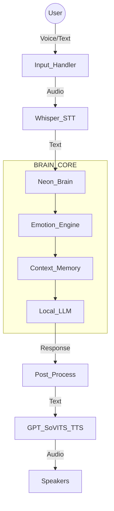

<div align="center">

# 🚀 Neon – AI Voice Companion  
### Local-First • Voice-Driven • Experimental AI System

<p>
  
  
  
  
</p>

<b>Mode-Driven Intelligence • Privacy Focused • System &gt; Model</b>

</div>

---

## 🧠 What Is Neon?

**Neon** is a local-first AI voice companion designed to run primarily on your own machine using a **fully local LLM pipeline**, with optional and tightly controlled online access.

What started as an experiment gradually evolved into a **complete AI system architecture** featuring:

- 🎭 **Emotion-Aware Responses** — internal state affects tone  
- 🧠 **Persistent Memory** — context awareness across sessions  
- 🗣️ **Real-Time Voice** — Whisper (STT) + GPT-SoVITS (TTS)  
- ⚡ **Dual Input Mode** — seamless text & voice switching  

⚠️ **This is not a chatbot wrapper.**  
Neon is an **AI system**, not just a model interface.

---

## ✨ Core Philosophy

- 🧠 **Local LLM First** — No mandatory cloud LLM APIs  
- 🔒 **Privacy-Focused** — Data stays on the user’s machine  
- 🎯 **Mode-Driven Intelligence** — Behavior changes with context  
- 🧪 **Experimental by Design** — Built for system-level exploration  
- 🧩 **System &gt; Model** — The LLM is a tool, not the decision-maker  

---

## 🎙️ Core Capabilities

- 🎤 **Voice Input** — Faster-Whisper (offline STT with VAD)  
- 🔊 **Voice Output** — GPT-SoVITS (high-quality custom TTS)  
- 🧠 **Local LLM** — Ollama (Mistral / LLaMA based)  
- 😐 **Emotion Engine** — mood derived from conversation context  
- 🔌 **Offline-First Operation** — works without internet  

---

## 🧱 System Architecture

**Key Principle:**  
The LLM never directly controls responses.

All outputs pass through emotion analysis, rule constraints, and post-processing filters.


```📂 Project Structure
Neon/
│
├── main.py                     # Application entry point (Dual Input)
├── requirements.txt            # Dependencies
│
├── brain/                      # LLM interaction + logic
│   ├── llm.py                  # Ollama interface
│   └── prompt.py               # Dynamic system prompts
│
├── core/                       # Emotion & safety
│   └── emotion.py              # Emotion state machine
│
├── memory/                     # Persistent local memory
│   └── memory.py               # JSON-based storage
│
├── style/                      # Output post-processing
│   └── postprocess.py
│
├── voice/                      # Audio I/O system
│   ├── hear.py                 # Whisper STT (VAD-based)
│   ├── speak.py                # GPT-SoVITS TTS + playback
│   ├── set_model.py            # Voice model loader
│   └── set_reference.py        # Reference voice setup
│
└── .gitignore                  # Runtime & private data ignored
```
▶️ How To Run
1️⃣ Requirements
Python 3.10+

Ollama installed & running

GPT-SoVITS API running locally (default: port 9880)

```2️⃣ Install Dependencies
pip install -r requirements.txt
```
```3️⃣ Start Neon
python main.py
```
Neon starts in interactive mode.
You can type text or press Enter to speak.

🧪 Project Status
✅ Core system functional

✅ Voice input (Whisper) & output (SoVITS) working

✅ Emotion & memory pipeline stable

⚠️ Experimental (architecture locked for iteration)

⚠️ Disclaimer
This is an experimental project built for learning, research, and AI system design exploration.
It is not a commercial product.

<div align="center">
🧠 Author
<b>Ansh</b>
<i>B.Tech CSE</i>

<b>Focus Areas</b>
AI Systems (not just models) • Offline-First Architecture • Controlled & Safe AI Design

<i> "Neon is not about how smart the model is. It’s about how controlled, safe, and purposeful AI should be." </i> </div> ```
