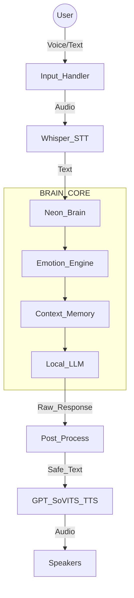

<div align="center">

# 🚀 Neon – AI Voice Companion  
### Local-First • Voice-Driven • Experimental AI System

<p>
  
  
  
  
  
</p>

<b>Mode-Driven Intelligence • Privacy-Focused • System > Model</b>

</div>

---

## 🧠 What Is Neon?

**Neon** is a **local-first AI voice companion** designed to run primarily on your own machine using a **fully offline LLM + voice pipeline**, with optional and tightly-controlled online access.

What started as an experiment evolved into a **full AI system architecture**, not just a chatbot interface.

⚠️ **Neon is not a chatbot wrapper.**  
It is a **system-level AI**, where the model is only one component.

---

## 🧬 Core AI Stack

- 🧠 **LLM Engine**  
  - Ollama (local runtime)  
  - **Noromaid (MistralRP-based)** model from Hugging Face  
  - Instruction-tuned for roleplay, personality control & system prompts  

- 🎤 **Speech-to-Text (STT)**  
  - Faster-Whisper (offline, VAD-based)

- 🔊 **Text-to-Speech (TTS)**  
  - GPT-SoVITS (high-quality voice cloning)

---

## ✨ Core Philosophy

- 🧠 **Local LLM First** — No mandatory cloud APIs  
- 🔒 **Privacy-Focused** — Data never leaves the machine  
- 🎭 **Mode-Driven Intelligence** — Behavior adapts to context & emotion  
- 🧪 **Experimental by Design** — Built for AI system research  
- 🧩 **System > Model** — The LLM never makes final decisions  

---

## 🎙️ Core Capabilities

- 🎤 **Voice Input** — Offline Whisper STT with VAD  
- 🔊 **Voice Output** — GPT-SoVITS (custom voice profiles)  
- 🧠 **Local LLM Reasoning** — Noromaid via Ollama  
- 😐 **Emotion Engine** — Internal mood affects tone & response style  
- 🧠 **Persistent Memory** — Context survives restarts  
- ⚡ **Dual Input Mode** — Text ↔ Voice seamlessly  

---

## 🧱 System Architecture

**Key Rule:**  
The LLM never speaks directly to the user.

Every response passes through **emotion analysis, memory context, rule filters, and post-processing**.


```📂 Project Structure
Neon/
│
├── main.py                     # Application entry point (Text + Voice)
├── requirements.txt
│
├── brain/
│   ├── llm.py                  # Ollama + Noromaid interface
│   └── prompt.py               # Dynamic system prompts
│
├── core/
│   └── emotion.py              # Emotion state machine
│
├── memory/
│   └── memory.py               # Persistent JSON memory
│
├── style/
│   └── postprocess.py          # Response shaping & safety
│
├── voice/
│   ├── hear.py                 # Whisper STT (VAD)
│   ├── speak.py                # GPT-SoVITS TTS
│   ├── set_model.py            # Voice model loader
│   └── set_reference.py        # Voice reference config
│
└── .gitignore
```
▶️ How To Run
```1️⃣ Requirements
Python 3.10+

Ollama (running locally)

GPT-SoVITS API (default port: 9880)
```
```2️⃣ Install Dependencies
pip install -r requirements.txt
```
```3️⃣ Start Neon
python main.py
```
Neon launches in interactive mode
→ Type text or press Enter to speak.

🧪 Project Status
✅ Core system functional
✅ Whisper + SoVITS fully working
✅ Emotion & memory pipeline stable

⚠️ Experimental
⚠️ Architecture locked for iteration & research

⚠️ Disclaimer
This project is built for learning, experimentation, and AI system design research.
It is not a commercial product.

<div align="center">
🧠 Author
<b>Ansh</b>
<i>B.Tech CSE</i>

<b>Focus Areas</b>
AI Systems (not just models) • Offline-First AI • Controlled & Safe AI Design

<i>“Neon is not about how smart the model is.
It’s about how controlled, safe, and purposeful AI should be.”</i>

</div> 
