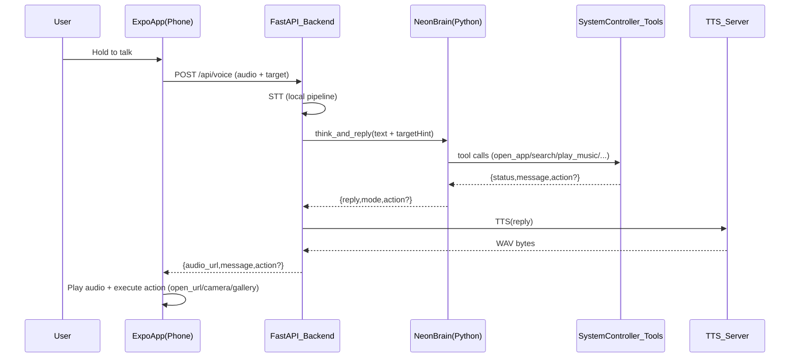

# NEON AI System

[](#requirements)
[](#run-mobile-app-expo)
[](#run-mobile-backend-fastapi)

Neon is a hybrid **desktop + mobile AI assistant**:

- **Desktop app**: runs locally (`main.py`) with voice input/output and can open apps on your PC.
- **Mobile app (Expo)**: a premium UI that talks to a backend and can open apps/links on your phone.
- **Backend (FastAPI)**: handles chat + voice pipeline (STT → brain → TTS), media upload (DP/wallpaper), and returns **action payloads** the mobile app can execute (open_url / camera / gallery).

This repo contains both the Python assistant and the Expo app under `NEON-FRONTEND/`.

---

## Table of Contents

- [Repo layout](#repo-layout)
- [Features (high-level)](#features-high-level)
- [Architecture diagrams](#architecture-diagrams)
- [Requirements](#requirements)
- [Environment variables](#environment-variables)
- [How targeting works (mobile vs desktop)](#how-targeting-works-mobile-vs-desktop)
- [Run: Desktop Neon (local)](#run-desktop-neon-local)
- [Run: Mobile backend (FastAPI)](#run-mobile-backend-fastapi)
- [Run: Mobile app (Expo)](#run-mobile-app-expo)
- [Build APK (Android)](#build-apk-android)
- [Common issues / fixes](#common-issues--fixes)
- [Developer: smoke test commands (offline)](#developer-smoke-test-commands-offline)

---

## Repo layout

- `main.py`: Neon desktop runner (voice + CLI loop)
- `brain/`: LLM logic, tools, personality layer
  - `brain/llm.py`: model selection (large/small), tool calling, routing to mobile/desktop
  - `brain/system_controller.py`: tools (open_app, search, play_music, system_status, etc.)
- `memory/`: persistent state in `memory/state/state.json`
- `voice/`: STT/TTS integration
- `style/`: reply postprocessing
- `NEON-FRONTEND/backend/server.py`: FastAPI backend for mobile app
- `NEON-FRONTEND/frontend/`: Expo (React Native) mobile app
- `scripts/smoke_commands.py`: offline smoke test for tool outputs/actions

---

## Features (high-level)

### Desktop assistant
- Voice input (STT) and voice output (TTS)
- “Command” tool calling:
  - open apps (desktop)
  - Google / YouTube search
  - play music (Spotify / YouTube Music)
  - system status checks
- Persistent personality + preferences saved to memory

### Mobile app
- Premium glass UI + video/live wallpaper support
- Server-backed DP and wallpaper (upload to backend, store URL)
- Mobile actions:
  - open URLs
  - open WhatsApp / Instagram / ChatGPT
  - open Camera / Gallery
- Default Target setting: **mobile / desktop** (so you don’t have to say it every time)

---

## Architecture diagrams

### End-to-end flow (mobile voice)


```mermaid
sequenceDiagram
  participant User
  participant ExpoApp as ExpoApp(Phone)
  participant Backend as FastAPI_Backend
  participant Brain as NeonBrain(Python)
  participant Tools as SystemController_Tools
  participant TTS as TTS_Server

  User->>ExpoApp: Hold to talk
  ExpoApp->>Backend: POST /api/voice (audio + target)
  Backend->>Backend: STT (local pipeline)
  Backend->>Brain: think_and_reply(text + targetHint)
  Brain->>Tools: tool calls (open_app/search/play_music/...)
  Tools-->>Brain: {status,message,action?}
  Brain-->>Backend: {reply,mode,action?}
  Backend->>TTS: TTS(reply)
  TTS-->>Backend: WAV bytes
  Backend-->>ExpoApp: {audio_url,message,action?}
  ExpoApp->>ExpoApp: Play audio + execute action (open_url/camera/gallery)
```

### Command routing (mobile vs desktop)

```mermaid
flowchart TD
  UserText[User Text]

  TargetHint{Contains mobile/desktop? or DefaultTarget}
  Headless{NEON_HEADLESS == 1?}

  MobileAction[Return action payload (open_url / open_camera / open_gallery)]
  DesktopAction[Open desktop app or browser]
  ErrorDesktop[Return friendly error: Desktop requested]

  UserText --> TargetHint

  TargetHint -->|mobile| MobileAction
  TargetHint -->|desktop| Headless
  TargetHint -->|auto| Headless

  Headless -->|yes| ErrorDesktop
  Headless -->|no| DesktopAction
```

---

## Requirements

### Python (desktop + backend)
- Python 3.10+ recommended
- Ollama running locally for LLM:
  - default endpoints: `http://localhost:11434/api/chat` and fallback `.../api/generate`
- Optional services depending on what you use:
  - GPT-SoVITS TTS server
  - Faster-Whisper STT module
  - MongoDB for backend logs/media metadata (backend continues even if Mongo insert fails for media)

### Mobile app (Expo)
- Node + npm
- Expo CLI via `npx expo ...`

---

## Environment variables

### Brain / Ollama models
In `brain/llm.py`:

- `NEON_MODEL_LARGE` (default: `llama3.2:3b`)
- `NEON_MODEL_SMALL` (default: `llama3.2:1b`)

### Headless routing (mobile vs desktop)
`NEON_HEADLESS`:

- `1`: running in mobile/server mode (tools should return **action payloads** instead of opening desktop apps)
- `0`: running locally (desktop actions allowed)

The mobile backend sets this **per request** based on `target` and restores it safely.

---

## How targeting works (mobile vs desktop)

Neon supports a simple routing rule:

- If you say **“mobile”**, Neon returns a mobile action (open_url / open_camera / open_gallery).
- If you say **“desktop”**, Neon tries to open the app/site on your PC.
- In the mobile backend, you can also set `Default Target` in the app settings.

Examples:
- `open whatsapp mobile`
- `open chrome desktop`
- `play lofi mobile`
- `search youtube desktop`

---

## Run: Desktop Neon (local)

From repo root:

```bash
python main.py
```

In-app commands:
- press **Enter** for voice input
- `help` for the command menu
- `exit` to quit

---

## Run: Mobile backend (FastAPI)

From:

```bash
cd NEON-FRONTEND/backend
pip install -r requirements.txt
uvicorn server:app --host 0.0.0.0 --port 9000 --reload
```

Key endpoints:
- `POST /api/chat` → `{ reply, mode, action? }`
- `POST /api/voice` → `{ audio_url, message, action? }`
- `POST /api/media/upload?type=wallpaper|dp`
- `GET /api/media/latest?type=wallpaper|dp`

---

## Run: Mobile app (Expo)

```bash
cd NEON-FRONTEND/frontend
npm install
npx expo start -c
```

On Android:
- Run on device with Expo Go, or
- Build APK (see below)

---

## Build APK (Android)

### Option A: Cloud build (no Android Studio required) — EAS Build

```bash
cd NEON-FRONTEND/frontend
npm install
npm i -g eas-cli
eas login
eas build:configure
eas build -p android --profile preview
```

Notes:
- Free plan works but can wait in queue.
- When finished, EAS gives you a download link for the APK.

### Option B: Local build (requires Android SDK / Android Studio)

```bash
cd NEON-FRONTEND/frontend
npx expo prebuild
npx expo run:android --variant release
```

To produce a shareable APK:

```bash
cd NEON-FRONTEND/frontend/android
./gradlew assembleRelease
```

APK path:
- `NEON-FRONTEND/frontend/android/app/build/outputs/apk/release/app-release.apk`

---

## Common issues / fixes

### “YouTube opens in Expo Go but not in APK”
This is typically Android package visibility / `canOpenURL` behavior. The app is set to open `http(s)` links directly using `Linking.openURL()`.

### “Video wallpaper save failed / no storage directory”
The app saves video wallpapers to the app’s writable directory when possible, and falls back to using the picked URI if the device provides a `content://` URI that cannot be copied.

### “Desktop requested, but I’m running in mobile/server mode”
This means the backend is in headless mode. Either:
- switch Default Target to **mobile**, or
- run Neon locally for desktop actions.

---

## Developer: smoke test commands (offline)

This checks tool outputs and action payload shapes without needing the LLM:

```bash
python scripts/smoke_commands.py
```

---

## Security notes

- Desktop “open app” actions are only safe when running locally.
- High-risk actions (delete file, WhatsApp automation) can require confirmation depending on configuration.

---

## License

Add your license here (MIT / Apache-2.0 / proprietary).

